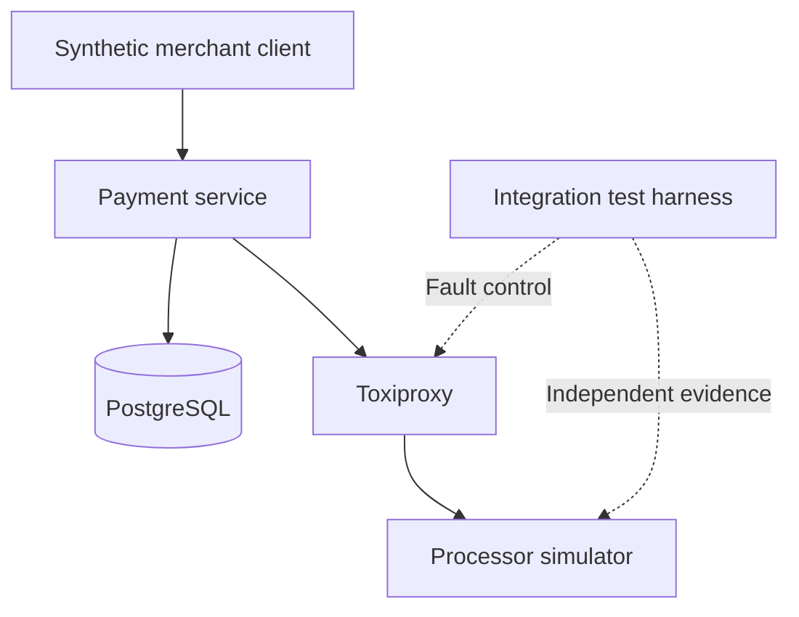

# Architecture

Status: PROPOSED.

The simulator represents an external provider. Toxiproxy belongs to the laboratory network, not a required production intermediary. The test harness can examine external truth, while the payment service cannot bypass faults.

## Proposed persistence

| Table | Principal fields | Constraints |
| --- | --- | --- |
| payment | id, merchant_id, order_id, amount_minor BIGINT, currency, status, created_at, updated_at | PK id; positive/bounded amount; allowed currency/status |
| payment_attempt | id, payment_id, processor_key, status, processor_reference nullable, created_at, updated_at | FK payment; UNIQUE payment_id and processor_key; allowed status |
| idempotency_record | merchant_id, idempotency_key, request_fingerprint, payment_id, created_at | composite PK merchant/key; FK payment |

No raw request body or token needs to be persisted in Iteration 1. The fingerprint can include the synthetic alias without storing it in plaintext. No order-level uniqueness is promised: a different idempotency key creates a different payment, even for the same order.

## Transaction boundaries

1. Validate, fingerprint and look for existing key. This early lookup is an optimization, not the correctness boundary.
2. In transaction A, insert payment, attempt and key. On uniqueness conflict roll back and return the existing payment after comparing fingerprints. Only the winning insertion returns an internal dispatch decision.
3. After commit, call the processor once through Toxiproxy using the persisted key. Set finite connection and response timeouts; disable client retries.
4. In transaction B, update payment and attempt together to a known outcome or UNKNOWN. Use guarded state updates. Return persisted state only after commit.
5. If B fails, return a generic 503 if possible; never falsely claim success. The original records remain available. Replaying the key does not call the processor again.

Database failure before A commits prevents the processor call. Failure after A commits can strand the payment. A database transaction cannot atomically encompass a remote processor; this is the explicit availability tradeoff in the first iteration.

## Planned code boundaries

`payment-service`: API validation/controller → authorization application service → JDBC repositories and HTTP processor adapter. Keep transaction control explicit. `processor-simulator`: isolated API and atomic in-memory operation registry. `integration-tests`: container lifecycle, black-box HTTP assertions and database/processor evidence.

Start with one payment instance. Database uniqueness is mandatory now, but the 20-request concurrency proof and UNKNOWN recovery are separate Iteration 2 gates. Do not advertise horizontally scalable correctness before those tests.
